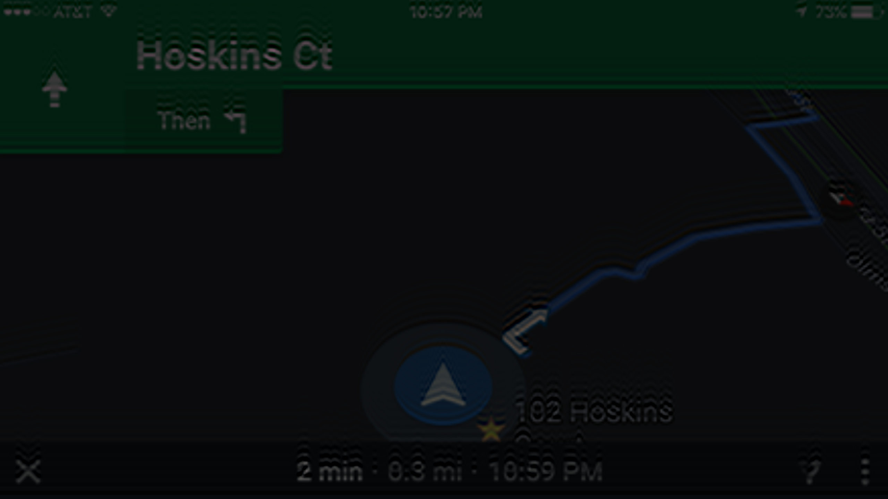

# GhostImageOptimization
基于最小二乘法优化图像重影
由于图像映射到汽车前挡风玻璃或者其他会产生重影的现象，如图

为了优化这种现象，参考论文 **Image optimization on smartphone based HUD display.pdf**，复现了论文中的的思路

### 原图

### 复现效果图

# Run Code
To run the code

`python virtualImageOptimize.py`

# Discussion
论文中有一个计算重影距离的公式，我们光学同事说是不准确的，于是给了我这篇论文 **Wedge-Angle-Measurements-for-HUD-displaysfinal.pdf**，按照这篇论文计算距离代码在 `VirtualImageDistance.py`，如果使用这个距离公式优化重影的话，效果是不理想的，只做参考。
